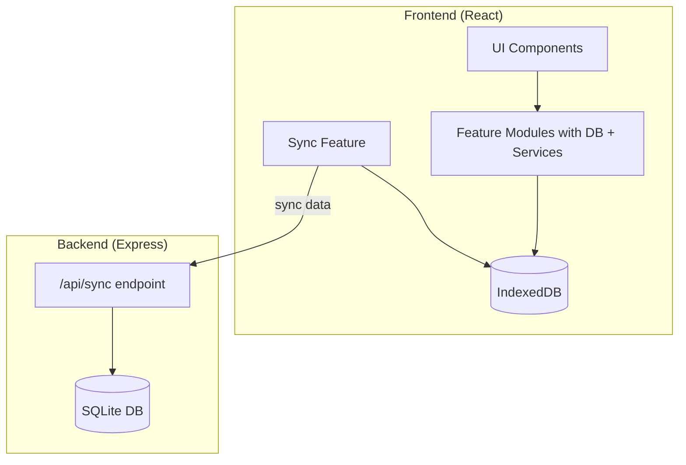

# Local-First Frontend with IndexedDB

## Architecture Overview



## Modular Frontend Structure

```
frontend/src/
├── app/
│   ├── App.tsx
│   └── main.tsx
├── features/
│   ├── teams/
│   │   ├── db/
│   │   │   └── TeamRepository.ts
│   │   ├── services/
│   │   │   └── TeamService.ts
│   │   ├── api/
│   │   │   └── teamApi.ts (updated to use local service)
│   │   ├── ui/
│   │   │   ├── TeamList.tsx
│   │   │   └── TeamForm.tsx
│   │   └── index.ts
│   ├── races/
│   │   ├── db/
│   │   │   └── RaceRepository.ts
│   │   ├── services/
│   │   │   └── RaceService.ts
│   │   ├── api/
│   │   │   └── raceApi.ts
│   │   ├── ui/
│   │   │   └── ...
│   │   └── index.ts
│   ├── karts/
│   │   ├── db/
│   │   │   └── KartRepository.ts
│   │   ├── services/
│   │   │   └── KartService.ts
│   │   ├── api/
│   │   │   └── kartApi.ts
│   │   ├── ui/
│   │   │   └── ...
│   │   └── index.ts
│   ├── pitlane/
│   │   ├── db/
│   │   │   ├── PitlaneConfigRepository.ts
│   │   │   ├── PitlaneCurrentRepository.ts
│   │   │   └── PitlaneHistoryRepository.ts
│   │   ├── services/
│   │   │   └── PitlaneService.ts (full queue logic)
│   │   ├── api/
│   │   │   └── pitlaneApi.ts
│   │   ├── ui/
│   │   │   └── ...
│   │   └── index.ts
│   └── sync/
│       ├── db/
│       │   └── SyncMetaRepository.ts
│       ├── services/
│       │   └── SyncManager.ts
│       ├── ui/
│       │   └── SyncStatusIndicator.tsx
│       ├── context/
│       │   └── SyncContext.tsx
│       ├── hooks/
│       │   └── useSyncStatus.ts
│       └── index.ts
└── shared/
    ├── db/
    │   └── database.ts (IndexedDB setup, shared instance)
    ├── types/
    │   └── ... (existing types + sync fields)
    └── components/
        └── ... (Layout, Navigation, etc.)
```

## Data Flow

1. **All operations** first write to IndexedDB with `updatedAt` timestamp
2. **SyncManager** attempts to push changes to backend after each operation
3. **On sync failure**: Set status to "offline", stop individual API calls
4. **While offline**: Periodically retry sync endpoint (every 30s)
5. **On sync success**: Pull newer server data, push local changes, set status to "online"

## IndexedDB Schema

**Database Version: 2** (start with version 2 to align with existing backend schema version)

All tables get sync fields:

- `updatedAt: number` (timestamp for last-write-wins)
- `isDeleted: boolean` (soft delete flag)
- `deletedAt: number | null`

**Object Stores:** teams, races, race_teams, karts, pitlane_configs, pitlane_current, pitlane_history, sync_meta

```typescript
// database.ts
const DB_NAME = 'race-stats';
const DB_VERSION = 2;

const db = await openDB(DB_NAME, DB_VERSION, {
  upgrade(db, oldVersion, newVersion) {
    // Version 2: Initial schema with all stores
    if (oldVersion < 2) {
      // Create all object stores with indexes
      const teams = db.createObjectStore('teams', { keyPath: 'id', autoIncrement: true });
      teams.createIndex('updatedAt', 'updatedAt');
      
      const races = db.createObjectStore('races', { keyPath: 'id', autoIncrement: true });
      races.createIndex('updatedAt', 'updatedAt');
      
      const raceTeams = db.createObjectStore('race_teams', { keyPath: ['raceId', 'teamId'] });
      raceTeams.createIndex('updatedAt', 'updatedAt');
      
      const karts = db.createObjectStore('karts', { keyPath: 'id', autoIncrement: true });
      karts.createIndex('raceId', 'raceId');
      karts.createIndex('teamId', 'teamId');
      karts.createIndex('updatedAt', 'updatedAt');
      
      const pitlaneConfigs = db.createObjectStore('pitlane_configs', { keyPath: 'id', autoIncrement: true });
      pitlaneConfigs.createIndex('raceId', 'raceId');
      pitlaneConfigs.createIndex('updatedAt', 'updatedAt');
      
      const pitlaneCurrent = db.createObjectStore('pitlane_current', { keyPath: 'id', autoIncrement: true });
      pitlaneCurrent.createIndex('pitlaneConfigId', 'pitlaneConfigId');
      pitlaneCurrent.createIndex('updatedAt', 'updatedAt');
      
      const pitlaneHistory = db.createObjectStore('pitlane_history', { keyPath: 'id', autoIncrement: true });
      pitlaneHistory.createIndex('pitlaneConfigId', 'pitlaneConfigId');
      pitlaneHistory.createIndex('updatedAt', 'updatedAt');
      
      db.createObjectStore('sync_meta', { keyPath: 'key' });
    }
  }
});
```

## Key Business Logic Migration

### Kart Service (from [`backend/src/modules/kart/services/KartService.ts`](backend/src/modules/kart/services/KartService.ts))

- Status validation (1-5)
- Team assignment: when assigning kart to team, unassign any existing kart from that team

### Pitlane Service (from [`backend/src/modules/pitlane/repositories/PitlaneCurrentRepository.ts`](backend/src/modules/pitlane/repositories/PitlaneCurrentRepository.ts))

- Queue management with configurable queue size
- Auto-remove first kart when queue full, shift positions
- Move removed karts to history with exitedAt timestamp
- Auto-unassign kart from team when entering pitlane
- Auto-assign kart to team when exiting pitlane

## Sync Protocol

```typescript
// POST /api/sync
Request: {
  lastSyncTimestamp: number,
  changes: {
    teams: TeamRecord[],
    races: RaceRecord[],
    race_teams: RaceTeamRecord[],
    karts: KartRecord[],
    pitlane_configs: PitlaneConfigRecord[],
    pitlane_current: PitlaneCurrentRecord[],
    pitlane_history: PitlaneHistoryRecord[]
  }
}

Response: {
  serverTimestamp: number,
  changes: { /* records newer than lastSyncTimestamp */ }
}
```

## Files to Create/Modify

### Frontend - New Files

- `frontend/src/shared/db/database.ts` - IndexedDB init
- `frontend/src/features/teams/db/TeamRepository.ts`
- `frontend/src/features/teams/services/TeamService.ts`
- `frontend/src/features/races/db/RaceRepository.ts`
- `frontend/src/features/races/services/RaceService.ts`
- `frontend/src/features/karts/db/KartRepository.ts`
- `frontend/src/features/karts/services/KartService.ts`
- `frontend/src/features/pitlane/db/Pitlane*Repository.ts` (3 files)
- `frontend/src/features/pitlane/services/PitlaneService.ts`
- `frontend/src/features/sync/` (full feature: db, services, ui, context, hooks)

### Frontend - Modified Files

- `frontend/src/app/App.tsx` - Wrap with SyncProvider
- `frontend/src/shared/components/Layout.tsx` - Add SyncStatusIndicator
- `frontend/src/shared/types/*.ts` - Add sync fields
- `frontend/src/features/*/api/*.ts` - Use local services

### Backend - New/Modified

- Add sync fields to all entities
- Create `/api/sync` endpoint in `backend/src/modules/sync/`
- Remove individual CRUD routes

## Dependencies

**Frontend:** Add `idb` package for IndexedDB wrapper