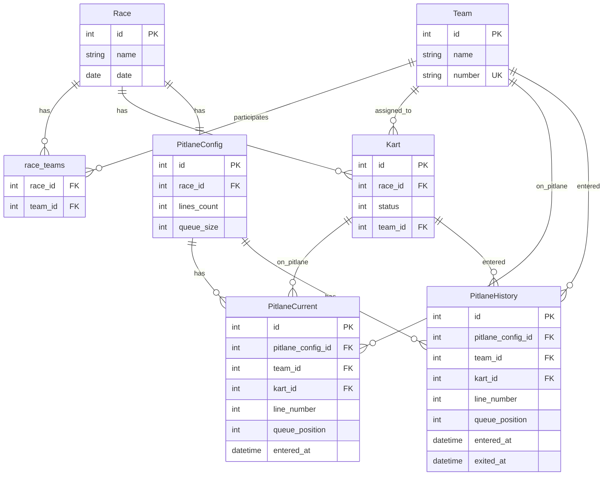

# Race Management System - Modular Backend & Frontend

## Обзор

Создание нового модульного бэкенда в папке `backend/` на основе DDD архитектуры из `scrapper/`, и полная переработка фронтенда для поддержки управления заездами. Бэкенд будет разделен на модули: Team, Race, Kart, Pitlane. Фронтенд получит современный дизайн.

## Архитектура

### Структура бэкенда (модульная DDD)

```
backend/
├── src/
│   ├── modules/
│   │   ├── team/
│   │   │   ├── entities/Team.ts
│   │   │   ├── repositories/TeamRepository.ts
│   │   │   ├── services/TeamService.ts
│   │   │   ├── controllers/TeamController.ts
│   │   │   └── routes/teamRoutes.ts
│   │   ├── race/
│   │   │   ├── entities/Race.ts
│   │   │   ├── repositories/RaceRepository.ts
│   │   │   ├── services/RaceService.ts
│   │   │   ├── controllers/RaceController.ts
│   │   │   └── routes/raceRoutes.ts
│   │   ├── kart/
│   │   │   ├── entities/Kart.ts
│   │   │   ├── repositories/KartRepository.ts
│   │   │   ├── services/KartService.ts
│   │   │   ├── controllers/KartController.ts
│   │   │   └── routes/kartRoutes.ts
│   │   └── pitlane/
│   │       ├── entities/
│   │       │   ├── PitlaneConfig.ts
│   │       │   ├── PitlaneCurrent.ts
│   │       │   └── PitlaneHistory.ts
│   │       ├── repositories/
│   │       │   ├── PitlaneConfigRepository.ts
│   │       │   ├── PitlaneCurrentRepository.ts
│   │       │   └── PitlaneHistoryRepository.ts
│   │       ├── services/PitlaneService.ts
│   │       ├── controllers/PitlaneController.ts
│   │       └── routes/pitlaneRoutes.ts
│   ├── shared/
│   │   ├── database/Database.ts
│   │   └── server/ExpressServer.ts
│   └── index.ts
```

### Модель данных



## Реализация

### Backend модули

#### 1. Team Module

**Entity** (`backend/src/modules/team/entities/Team.ts`):

- TypeORM entity с декораторами `@Entity()`, `@PrimaryGeneratedColumn()`, `@Column()`, `@Index()` или `@Unique()`
- Поля: `id`, `name`, `number` (unique)

**Repository** (`backend/src/modules/team/repositories/TeamRepository.ts`):

- Использует TypeORM `Repository<Team>` или кастомные методы
- `create(team: Team): Promise<Team>`
- `findById(id: number): Promise<Team | null>`
- `findByNumber(number: string): Promise<Team | null>`
- `findAll(): Promise<Team[]>`
- `update(team: Team): Promise<Team>`
- `delete(id: number): Promise<void>`

**Service** (`backend/src/modules/team/services/TeamService.ts`):

- Бизнес-логика для работы с командами (валидация, дополнительные проверки)

**Database Table**: `teams` (id, name, number UNIQUE) - создается автоматически через TypeORM migrations или synchronize

#### 2. Race Module

**Entity** (`backend/src/modules/race/entities/Race.ts`):

- TypeORM entity с декораторами
- Поля: `id`, `name`, `date`
- Many-to-many связь с Team через `@ManyToMany()` и `@JoinTable()`

**Repository** (`backend/src/modules/race/repositories/RaceRepository.ts`):

- Использует TypeORM `Repository<Race>` или кастомные методы
- `create(race: Race): Promise<Race>`
- `findById(id: number): Promise<Race | null>`
- `findAll(): Promise<Race[]>`
- `update(race: Race): Promise<Race>`
- `delete(id: number): Promise<void>`
- `addTeam(raceId: number, teamId: number): Promise<void>`
- `removeTeam(raceId: number, teamId: number): Promise<void>`
- `getTeams(raceId: number): Promise<Team[]>`

**Service** (`backend/src/modules/race/services/RaceService.ts`):

- Бизнес-логика для работы с заездами

**Database Tables**:

- `races` (id, name, date) - создается автоматически через TypeORM
- `race_teams` (race_id, team_id) - many-to-many, создается автоматически через TypeORM

#### 3. Kart Module

**Entity** (`backend/src/modules/kart/entities/Kart.ts`):

- TypeORM entity с декораторами
- Поля: `id`, `raceId`, `status` (default 1), `teamId` (nullable)
- Связи: `@ManyToOne()` с Race, `@ManyToOne()` с Team (nullable)

**Repository** (`backend/src/modules/kart/repositories/KartRepository.ts`):

- Использует TypeORM `Repository<Kart>` или кастомные методы
- `create(kart: Kart): Promise<Kart>`
- `createMany(raceId: number, count: number): Promise<Kart[]>` - создать список картов (status=1, teamId=null)
- `findById(id: number): Promise<Kart | null>`
- `findByRace(raceId: number): Promise<Kart[]>`
- `findByTeam(teamId: number): Promise<Kart[]>`
- `update(kart: Kart): Promise<Kart>`
- `delete(id: number): Promise<void>`
- `assignTeam(kartId: number, teamId: number | null): Promise<void>`
- `updateStatus(kartId: number, status: number): Promise<void>`

**Service** (`backend/src/modules/kart/services/KartService.ts`):

- Бизнес-логика для работы с картами

**Database Table**: `karts` (id, race_id FK, status DEFAULT 1, team_id FK nullable) - создается автоматически через TypeORM

#### 4. Pitlane Module

**Entities**:

- `PitlaneConfig` (`backend/src/modules/pitlane/entities/PitlaneConfig.ts`): TypeORM entity с полями `id`, `raceId`, `linesCount`, `queueSize`, связь `@OneToOne()` с Race
- `PitlaneCurrent` (`backend/src/modules/pitlane/entities/PitlaneCurrent.ts`): TypeORM entity с полями `id`, `pitlaneConfigId`, `teamId`, `kartId`, `lineNumber`, `queuePosition`, `enteredAt`, связи `@ManyToOne()` с PitlaneConfig, Team, Kart, `@Unique()` на (pitlaneConfigId, lineNumber, queuePosition) - текущее состояние питлейна
- `PitlaneHistory` (`backend/src/modules/pitlane/entities/PitlaneHistory.ts`): TypeORM entity с полями `id`, `pitlaneConfigId`, `teamId`, `kartId`, `lineNumber`, `queuePosition`, `enteredAt`, `exitedAt`, связи `@ManyToOne()` с PitlaneConfig, Team, Kart - история заходов/выходов

**Repositories**:

- `PitlaneConfigRepository` (`backend/src/modules/pitlane/repositories/PitlaneConfigRepository.ts`): Использует TypeORM `Repository<PitlaneConfig>`, CRUD для конфигурации питлейна
- `PitlaneCurrentRepository` (`backend/src/modules/pitlane/repositories/PitlaneCurrentRepository.ts`): Использует TypeORM `Repository<PitlaneCurrent>`
  - `findByConfig(configId): Promise<PitlaneCurrent[]>`: получить все текущие записи для конфигурации
  - `findByLine(configId, lineNumber): Promise<PitlaneCurrent[]>`: получить текущие записи по линии
  - `addKart(configId, teamId, kartId, lineNumber, assignTeamIdToOldKart?): Promise<void>`: добавить карт в питлейн
    - Логика очереди: универсальная для любой длины очереди
    - **Автоматически снимает новый карт с команды**: если новый kart был назначен на teamId, то kart.teamId устанавливается в null
    - **Автоматически удаляет старый карт из питлейна**: если на позиции уже был карт, он автоматически удаляется (removeKart)
    - **Автоматически назначает старый карт на команду**: если передан assignTeamIdToOldKart, то старый kart.teamId устанавливается в assignTeamIdToOldKart
  - `removeKart(configId, lineNumber, queuePosition, teamId?): Promise<void>`: удалить карт из позиции
    - **Автоматически назначает карт на команду**: если передан teamId, то kart.teamId устанавливается в teamId
  - `clearLine(configId, lineNumber): Promise<void>`: очистить всю линию
- `PitlaneHistoryRepository` (`backend/src/modules/pitlane/repositories/PitlaneHistoryRepository.ts`): Использует TypeORM `Repository<PitlaneHistory>`
  - `findByConfig(configId): Promise<PitlaneHistory[]>`: получить историю для конфигурации
  - `findByLine(configId, lineNumber): Promise<PitlaneHistory[]>`: получить историю по линии
  - `create(entry): Promise<PitlaneHistory>`: создать запись в истории

**Service** (`backend/src/modules/pitlane/services/PitlaneService.ts`):

- Бизнес-логика для работы с питлейном (координация между репозиториями)

**Database Tables**:

- `pitlane_configs` (id, race_id FK UNIQUE, lines_count, queue_size)
- `pitlane_current` (id, pitlane_config_id FK, team_id FK, kart_id FK, line_number, queue_position, entered_at) - UNIQUE(pitlane_config_id, line_number, queue_position)
- `pitlane_history` (id, pitlane_config_id FK, team_id FK, kart_id FK, line_number, queue_position, entered_at, exited_at)

**Логика работы с очередью** (реализуется в `PitlaneCurrentRepository.addKart` и `removeKart`):

1. При добавлении нового карта в линию (`addKart`):

   - **Автоматически снимает новый карт с команды**: если новый kart был назначен на teamId, то `kart.teamId = null`
   - Если очередь заполнена (все позиции заняты):
     - Первый карт (queue_position = 0) автоматически удаляется из питлейна (removeKart)
     - Если передан `assignTeamIdToOldKart`, то первый `kart.teamId = assignTeamIdToOldKart`
     - Первый карт перемещается в историю с `exited_at = NOW()`
     - Все остальные карты сдвигаются на одну позицию вверх (queue_position уменьшается на 1)
     - Новый карт становится последним (queue_position = queue_size - 1)
   - Если очередь не заполнена:
     - Новый карт занимает первую свободную позицию (минимальный queue_position, который не занят)

2. При удалении карта из очереди (`removeKart`): 

   - Карт перемещается в историю с `exited_at = NOW()`
   - Все карты с большим `queue_position` сдвигаются на одну позицию вверх
   - **Автоматически назначает карт на команду**: если передан `teamId`, то `kart.teamId = teamId`

### API Endpoints

**Team Module**:

- `POST /api/teams` - создать команду
- `GET /api/teams` - список всех команд
- `GET /api/teams/:id` - получить команду
- `PUT /api/teams/:id` - обновить команду
- `DELETE /api/teams/:id` - удалить команду

**Race Module**:

- `POST /api/races` - создать заезд
- `GET /api/races` - список всех заездов
- `GET /api/races/:id` - получить заезд
- `PUT /api/races/:id` - обновить заезд
- `DELETE /api/races/:id` - удалить заезд
- `POST /api/races/:id/teams` - добавить команду в заезд (body: { teamId })
- `DELETE /api/races/:id/teams/:teamId` - удалить команду из заезда

**Kart Module**:

- `POST /api/karts` - создать карт (body: { raceId, teamId?, status? })
- `POST /api/karts/bulk` - создать список картов (body: { raceId, count }) - создает count картов со status=1, teamId=null
- `GET /api/karts?raceId=:raceId` - список картов заезда
- `GET /api/karts/:id` - получить карт
- `PUT /api/karts/:id` - обновить карт (body: { teamId?, status? })
- `DELETE /api/karts/:id` - удалить карт

**Pitlane Module**:

- `POST /api/pitlanes/configs` - создать конфигурацию (body: { raceId, linesCount, queueSize })
- `GET /api/pitlanes/configs?raceId=:raceId` - получить конфигурацию заезда
- `PUT /api/pitlanes/configs/:id` - обновить конфигурацию
- `POST /api/pitlanes/current/add` - добавить карт в питлейн (body: { pitlaneConfigId, teamId, kartId, lineNumber, assignTeamIdToOldKart? }) - автоматически обрабатывает логику очереди, снимает новый карт с команды (kart.teamId = null), автоматически удаляет старый карт из питлейна и назначает его на команду (если передан assignTeamIdToOldKart)
- `GET /api/pitlanes/current?configId=:configId` - получить текущее состояние питлейна
- `GET /api/pitlanes/current?configId=:configId&lineNumber=:lineNumber` - получить текущее состояние по линии
- `DELETE /api/pitlanes/current/:id` - удалить карт из питлейна (body: { teamId? }) - переместить в историю, если передан teamId, то автоматически назначает карт на команду (kart.teamId = teamId)
- `DELETE /api/pitlanes/current/line?configId=:configId&lineNumber=:lineNumber` - очистить всю линию
- `GET /api/pitlanes/history?configId=:configId` - получить историю заходов
- `GET /api/pitlanes/history?configId=:configId&lineNumber=:lineNumber` - получить историю по линии

### Frontend структура

```
frontend/src/
├── app/
│   ├── App.tsx (роутинг)
│   └── index.css (глобальные стили)
├── features/
│   ├── teams/
│   │   ├── ui/TeamList.tsx
│   │   ├── ui/TeamForm.tsx
│   │   └── api/teamApi.ts
│   ├── races/
│   │   ├── ui/RaceList.tsx
│   │   ├── ui/RaceForm.tsx
│   │   ├── ui/RaceDetail.tsx
│   │   └── api/raceApi.ts
│   ├── karts/
│   │   ├── ui/KartList.tsx
│   │   ├── ui/KartCard.tsx
│   │   ├── ui/KartEditModal.tsx
│   │   └── api/kartApi.ts
│   └── pitlane/
│       ├── ui/PitlaneConfigForm.tsx
│       ├── ui/PitlaneView.tsx
│       ├── ui/PitlaneEntryForm.tsx
│       └── api/pitlaneApi.ts
├── pages/
│   ├── TeamsPage.tsx
│   ├── RacesPage.tsx
│   ├── RaceDetailPage.tsx
│   ├── KartsPage.tsx
│   └── PitlanePage.tsx
└── shared/
    ├── types/
    │   ├── team.ts
    │   ├── race.ts
    │   ├── kart.ts
    │   └── pitlane.ts
    └── components/
        ├── Layout.tsx
        ├── Navigation.tsx
        └── StatusBadge.tsx (цветные бейджи для статусов)
```

### Дизайн фронтенда

- **Цветовая схема**: современная палитра с градиентами
- **Компоненты**: карточки с тенями, плавные анимации, модальные окна
- **Статусы картов**: цветные индикаторы (1=зеленый, 2=желтый, 3=оранжевый, 4=красный, 5=черный)
- **UI библиотека**: PrimeReact (уже используется) + Tailwind CSS
- **Иконки**: PrimeIcons

### Миграция данных

Создать скрипт миграции для переноса существующих данных:

- `team_kart_status` → `teams` + `karts`
- `pitlane_kart_status` → `pitlane_configs` + `pitlane_entries`

## План выполнения

### Этап 1: Backend - Infrastructure & Database

1. Создать структуру папок `backend/`
2. Настроить `package.json` (добавить typeorm, sqlite3/better-sqlite3, reflect-metadata), `tsconfig.json` (включить experimentalDecorators, emitDecoratorMetadata)
3. Создать `Database.ts` с TypeORM DataSource, настроить подключение к SQLite
4. Реализовать базовую структуру Express сервера

### Этап 2: Backend - Team Module

1. Entity: `Team` (TypeORM entity с декораторами `@Entity()`, `@PrimaryGeneratedColumn()`, `@Column()`, `@Unique()`)
2. Repository: `TeamRepository` (использует TypeORM `Repository<Team>` или кастомные методы)
3. Service: `TeamService` (бизнес-логика)
4. Controller & Routes: `TeamController`, `teamRoutes`
5. Интеграция в Express сервер

### Этап 3: Backend - Race Module

1. Entity: `Race` (TypeORM entity с декораторами, `@ManyToMany()` связь с Team)
2. Repository: `RaceRepository` (использует TypeORM `Repository<Race>`, поддержка many-to-many через TypeORM)
3. Service: `RaceService` (бизнес-логика)
4. Controller & Routes: `RaceController`, `raceRoutes`
5. Интеграция в Express сервер

### Этап 4: Backend - Kart Module

1. Entity: `Kart` (TypeORM entity с декораторами, `@ManyToOne()` связи с Race и Team)
2. Repository: `KartRepository` (использует TypeORM `Repository<Kart>`)
3. Service: `KartService` (бизнес-логика)
4. Controller & Routes: `KartController`, `kartRoutes`
5. Интеграция в Express сервер

### Этап 5: Backend - Pitlane Module

1. Entities: `PitlaneConfig`, `PitlaneCurrent`, `PitlaneHistory` (TypeORM entities с декораторами, связи через `@ManyToOne()`, `@Unique()` для PitlaneCurrent)
2. Repositories: `PitlaneConfigRepository`, `PitlaneCurrentRepository`, `PitlaneHistoryRepository` (используют TypeORM `Repository<>`, логика обработки очереди в `PitlaneCurrentRepository.addKart`)
3. Service: `PitlaneService` (координация между репозиториями)
4. Controller & Routes: `PitlaneController`, `pitlaneRoutes`
5. Интеграция в Express сервер

### Этап 6: Frontend - Types & API

1. Создать TypeScript типы для всех сущностей
2. Создать API клиенты для всех модулей
3. Настроить базовый роутинг

### Этап 7: Frontend - Teams Feature

1. `TeamsPage` с списком команд
2. Форма создания/редактирования команды
3. Интеграция с API

### Этап 8: Frontend - Races Feature

1. `RacesPage` с списком заездов
2. `RaceDetailPage` с деталями заезда
3. Форма создания/редактирования заезда
4. Управление командами в заезде

### Этап 9: Frontend - Karts Feature

1. `KartsPage` с визуализацией картов (цветные карточки)
2. Модальное окно для редактирования карта (назначение команды, статус)
3. Фильтрация по заезду

### Этап 10: Frontend - Pitlane Feature

1. Форма конфигурации питлейна
2. `PitlanePage` с визуализацией линий и очереди (текущее состояние из `pitlane_current`)
3. Форма добавления карта в питлейн (автоматически обрабатывает логику очереди на бэкенде)
4. Отображение текущих картов на питлейне с позициями в очереди
5. Возможность удалить карт из питлейна (переместить в историю)
6. Просмотр истории заходов/выходов

### Этап 11: Frontend - Design & Polish

1. Применить современный дизайн ко всем страницам
2. Добавить анимации и переходы
3. Улучшить UX (loading states, error handling)
4. Адаптивная верстка

### Этап 12: Cleanup

1. Обновить `docker-compose.yml` для нового бэкенда
2. Обновить `nginx.conf` если нужно
3. Обновить документацию

## Технические детали

### Backend зависимости

- `express` - HTTP сервер
- `typeorm` - ORM для работы с базой данных
- `sqlite3` или `better-sqlite3` - драйвер SQLite для TypeORM
- `reflect-metadata` - требуется для TypeORM декораторов
- `dotenv` - переменные окружения
- `typescript` - типизация

### Frontend зависимости

- `react`, `react-dom` - UI фреймворк
- `primereact` - UI компоненты
- `tailwindcss` - стилизация
- `react-router-dom` - роутинг (нужно добавить)

### База данных

- SQLite (`race_data.db`)
- TypeORM DataSource для подключения к БД
- Entities с декораторами для автоматического создания схемы
- Все таблицы с внешними ключами (через TypeORM связи)
- Индексы на часто используемых полях (через `@Index()` декораторы)
- Использование `synchronize: true` в development или migrations в production

### Docker

- Обновить `docker-compose.yml` для нового бэкенда
- Backend контейнер: `backend:3000`
- Frontend контейнер: `frontend:80` (Nginx)
- Volume для БД: `backend_data`

## Файлы для изменения/создания

### Backend (новые файлы)

- `backend/package.json`
- `backend/tsconfig.json`
- `backend/src/index.ts`
- `backend/src/shared/database/Database.ts` (TypeORM DataSource с конфигурацией для SQLite)
- `backend/src/shared/server/ExpressServer.ts`
- **Team модуль**: `entities/Team.ts`, `repositories/TeamRepository.ts`, `services/TeamService.ts`, `controllers/TeamController.ts`, `routes/teamRoutes.ts`
- **Race модуль**: `entities/Race.ts`, `repositories/RaceRepository.ts`, `services/RaceService.ts`, `controllers/RaceController.ts`, `routes/raceRoutes.ts`
- **Kart модуль**: `entities/Kart.ts`, `repositories/KartRepository.ts`, `services/KartService.ts`, `controllers/KartController.ts`, `routes/kartRoutes.ts`
- **Pitlane модуль**: `entities/PitlaneConfig.ts`, `entities/PitlaneCurrent.ts`, `entities/PitlaneHistory.ts`, `repositories/PitlaneConfigRepository.ts`, `repositories/PitlaneCurrentRepository.ts`, `repositories/PitlaneHistoryRepository.ts`, `services/PitlaneService.ts`, `controllers/PitlaneController.ts`, `routes/pitlaneRoutes.ts`

### Frontend (изменения)

- `frontend/src/app/App.tsx` - добавить роутинг
- `frontend/src/shared/types/*.ts` - новые типы
- `frontend/src/shared/api/*.ts` - новые API клиенты
- `frontend/src/pages/*.tsx` - новые страницы
- `frontend/src/features/*/` - новые фичи
- `frontend/package.json` - добавить `react-router-dom`

### Конфигурация

- `docker-compose.yml` - обновить для нового бэкенда
- `nginx.conf` - проверить проксирование
- `.gitignore` - обновить если нужно