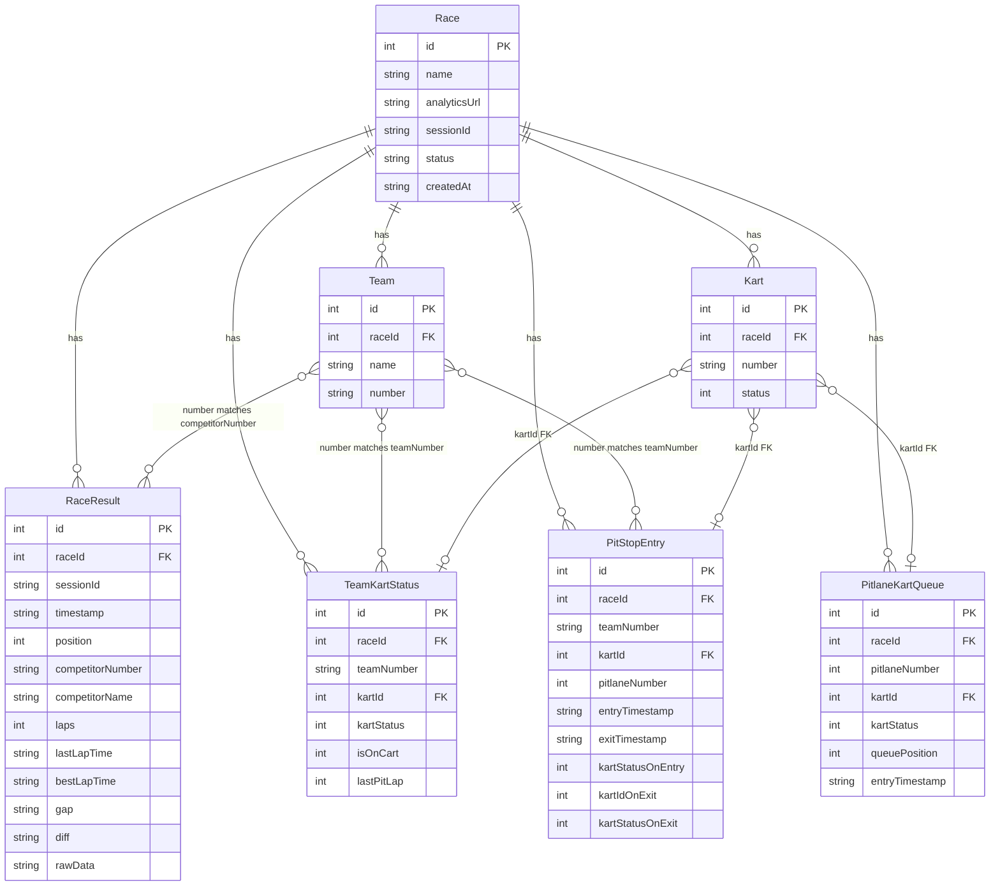

# План переработки проекта Race Stats

## Обзор изменений

Проект будет переработан для поддержки:

1. **Создание гонок (Race)** с опциональной привязкой к аналитическим URL
2. **Автоматическое извлечение** команд, картов и результатов из URL (SpeedHive и др.)
3. **Ручное управление** командами, картами и заездами в питстопы
4. **Логика обмена картами** между командами и питлейнами при питстопах

## Архитектура данных

### Новые сущности

#### 1. Race (Гонка)

- `id` - уникальный идентификатор
- `name` - название гонки
- `analyticsUrl` - URL аналитики (опционально, например SpeedHive)
- `sessionId` - ID сессии из URL (извлекается автоматически или задается вручную)
- `createdAt` - дата создания
- `status` - статус гонки (planned, active, finished)

#### 2. Team (Команда)

- `id` - уникальный идентификатор
- `raceId` - FK на Race
- `name` - название команды (уникальное в рамках гонки, используется для парсинга из RaceResult.competitorName)
- `number` - номер команды (уникальный в рамках гонки, используется для связи с RaceResult.competitorNumber, TeamKartStatus.teamNumber, PitStopEntry.teamNumber)

#### 3. Kart (Карт)

- `id` - уникальный идентификатор
- `raceId` - FK на Race
- `number` - номер карта (уникальный в рамках гонки)
- `status` - статус карта (1-5)
- Связи: используется в PitStopEntry.kartId, PitlaneKartQueue.kartId, TeamKartStatus.kartId

#### 4. PitStopEntry (Заезд в питстоп)

- `id` - уникальный идентификатор
- `raceId` - FK на Race
- `teamNumber` - номер команды (связь с Team.number)
- `kartId` - FK на Kart (карт, который был у команды при заезде)
- `pitlaneNumber` - номер питлейна (1-4)
- `entryTimestamp` - время заезда
- `exitTimestamp` - время выезда (опционально)
- `kartStatusOnEntry` - статус карта при заезде (из TeamKartStatus)
- `kartIdOnExit` - FK на Kart (карт, который забрала команда при выезде, опционально)
- `kartStatusOnExit` - статус карта при выезде (опционально)

### Изменения существующих сущностей

#### TeamKartStatus

- Добавить `raceId` - FK на Race
- `teamNumber` - номер команды (связь с Team.number)
- Добавить `kartId` - FK на Kart (текущий карт команды, опционально)
- Добавить `isOnCart` - флаг наличия карта (false = статус 0, команда без карта)
- Изменить логику: `kartStatus` может быть NULL когда `isOnCart = false`, `kartId` может быть NULL когда `isOnCart = false`

#### PitlaneKartStatus

- Добавить `raceId` - FK на Race
- Изменить структуру: вместо одной записи на питлейн, создать очередь картов
- Новая структура: `PitlaneKartQueue` - очередь картов в питлейне
  - `id`, `raceId`, `pitlaneNumber`, `kartId` (FK на Kart), `kartStatus`, `queuePosition`, `entryTimestamp`

#### RaceResult

- Добавить `raceId` - FK на Race
- `competitorNumber` - номер участника (связь с Team.number)
- `competitorName` - имя участника (используется для парсинга и создания Team по уникальному имени)
- `sessionId` остается для обратной совместимости

## Схема базы данных

**Примечание о логических связях (не FK на уровне БД):**

- `Team.number` связывается с `RaceResult.competitorNumber` (логическая связь)
- `Team.number` связывается с `TeamKartStatus.teamNumber` (логическая связь)
- `Team.number` связывается с `PitStopEntry.teamNumber` (логическая связь)

## Backend изменения

### 1. Domain Layer

#### Новые entities

- `scrapper/src/domain/entities/Race.ts` - сущность гонки
- `scrapper/src/domain/entities/Team.ts` - сущность команды
- `scrapper/src/domain/entities/Kart.ts` - сущность карта
- `scrapper/src/domain/entities/PitStopEntry.ts` - сущность заезда в питстоп

#### Обновленные entities

- `scrapper/src/domain/entities/RaceResult.ts` - добавить `raceId`
- `scrapper/src/domain/entities/TeamKartStatus.ts` - добавить `raceId`, `isOnCart`
- `scrapper/src/domain/entities/PitlaneKartStatus.ts` - заменить на `PitlaneKartQueue`

#### Новые repositories (interfaces)

- `scrapper/src/domain/repositories/IRaceRepository.ts`
- `scrapper/src/domain/repositories/ITeamRepository.ts`
- `scrapper/src/domain/repositories/IKartRepository.ts`
- `scrapper/src/domain/repositories/IPitStopEntryRepository.ts`

#### Обновленные repositories

- `scrapper/src/domain/repositories/IRaceResultRepository.ts` - добавить фильтр по `raceId`
- `scrapper/src/domain/repositories/ITeamKartStatusRepository.ts` - добавить фильтр по `raceId`
- `scrapper/src/domain/repositories/IPitlaneKartStatusRepository.ts` - заменить на `IPitlaneKartQueueRepository`

#### Новые services

- `scrapper/src/domain/services/IRaceService.ts` - бизнес-логика гонок
- `scrapper/src/domain/services/IPitStopService.ts` - логика обмена картами при питстопах
- `scrapper/src/domain/services/IAnalyticsParserService.ts` - парсинг данных из аналитических URL

### 2. Infrastructure Layer

#### Database

- `scrapper/src/infrastructure/database/Database.ts` - обновить схему БД:
  - Создать таблицы: 
    - `races` (id, name, analyticsUrl, sessionId, status, createdAt)
    - `teams` (id, raceId, name, number) - UNIQUE(raceId, name), UNIQUE(raceId, number)
    - `karts` (id, raceId, number, status) - UNIQUE(raceId, number)
    - `pit_stop_entries` (id, raceId, teamNumber, kartId, pitlaneNumber, entryTimestamp, exitTimestamp, kartStatusOnEntry, kartIdOnExit, kartStatusOnExit)
    - `pitlane_kart_queue` (id, raceId, pitlaneNumber, kartId, kartStatus, queuePosition, entryTimestamp)
  - Обновить таблицы: 
    - `race_results` (добавить `race_id`)
    - `team_kart_status` (добавить `race_id`, `kart_id`, `is_on_cart`)
  - Добавить миграцию для существующих данных (создать дефолтную гонку)

#### Repositories (implementations)

- `scrapper/src/infrastructure/database/RaceRepository.ts`
- `scrapper/src/infrastructure/database/TeamRepository.ts`
- `scrapper/src/infrastructure/database/KartRepository.ts`
- `scrapper/src/infrastructure/database/PitStopEntryRepository.ts`
- `scrapper/src/infrastructure/database/PitlaneKartQueueRepository.ts` (вместо PitlaneKartStatusRepository)
- Обновить существующие репозитории для поддержки `raceId`

#### Scraper

- `scrapper/src/infrastructure/scraper/PuppeteerScraper.ts` - обновить:
  - Принимать `raceId` и `analyticsUrl` в конструкторе
  - Извлекать `sessionId` из URL автоматически
  - Сохранять результаты с привязкой к `raceId`

#### Analytics Parser

- `scrapper/src/infrastructure/analytics/SpeedHiveParser.ts` - новый сервис:
  - Парсинг списка команд из страницы:
    - По уникальному `competitor_name` создавать Team (если еще не существует)
    - Использовать `competitor_number` как Team.number
    - Связывать RaceResult.competitorNumber с Team.number
  - Парсинг списка картов (если доступно)
  - Извлечение `sessionId` из URL

### 3. Presentation Layer

#### Controllers

- `scrapper/src/presentation/controllers/RaceController.ts` - новый контроллер:
  - `POST /api/races` - создать гонку
  - `GET /api/races` - список гонок
  - `GET /api/races/:id` - получить гонку
  - `PUT /api/races/:id` - обновить гонку
  - `DELETE /api/races/:id` - удалить гонку
  - `POST /api/races/:id/parse-analytics` - парсить данные из URL

- `scrapper/src/presentation/controllers/TeamController.ts` - новый контроллер:
  - `GET /api/races/:raceId/teams` - список команд гонки
  - `POST /api/races/:raceId/teams` - создать команду
  - `PUT /api/races/:raceId/teams/:id` - обновить команду
  - `DELETE /api/races/:raceId/teams/:id` - удалить команду

- `scrapper/src/presentation/controllers/KartController.ts` - новый контроллер:
  - `GET /api/races/:raceId/karts` - список картов гонки
  - `POST /api/races/:raceId/karts` - создать карт
  - `PUT /api/races/:raceId/karts/:id` - обновить карт
  - `DELETE /api/races/:raceId/karts/:id` - удалить карт

- `scrapper/src/presentation/controllers/PitStopController.ts` - новый контроллер:
  - `POST /api/races/:raceId/pitstops/entry` - заезд в питстоп (логика обмена картами)
  - `POST /api/races/:raceId/pitstops/exit` - выезд из питстопа (логика обмена картами)
  - `GET /api/races/:raceId/pitstops` - история питстопов

- Обновить `RaceResultController.ts`:
  - Все endpoints принимать `raceId` вместо `sessionId` (или поддерживать оба для обратной совместимости)

#### Routes

- `scrapper/src/presentation/routes/raceRoutes.ts` - новые маршруты
- `scrapper/src/presentation/routes/teamRoutes.ts`
- `scrapper/src/presentation/routes/kartRoutes.ts`
- `scrapper/src/presentation/routes/pitStopRoutes.ts`
- Обновить `scrapper/src/presentation/routes/raceResultRoutes.ts`

#### Services

- `scrapper/src/domain/services/PitStopService.ts` - реализация логики обмена картами:
  - При заезде: карт из TeamKartStatus → последний в очередь PitlaneKartQueue, команда без карта
  - При выезде: первый карт из очереди → команде в TeamKartStatus, удалить из очереди

### 4. Entry Point

- `scrapper/src/index.ts` - обновить инициализацию:
  - Создать новые репозитории и контроллеры
  - Зарегистрировать новые маршруты
  - Убрать автоматический запуск скрапера (только по запросу для конкретной гонки)

## Frontend изменения

### 1. Новые типы

- `frontend/src/shared/types/race.ts` - типы для Race, Team, Kart, PitStopEntry
- Обновить `frontend/src/shared/types/raceResult.ts` - добавить `raceId`

### 2. API клиент

- `frontend/src/shared/api/raceApi.ts` - новый файл:
  - `createRace()`, `getRaces()`, `getRace()`, `updateRace()`, `deleteRace()`
  - `parseAnalytics(raceId, url)` - запуск парсинга из URL

- `frontend/src/shared/api/teamApi.ts` - новый файл:
  - CRUD операции для команд

- `frontend/src/shared/api/kartApi.ts` - новый файл:
  - CRUD операции для картов

- `frontend/src/shared/api/pitStopApi.ts` - новый файл:
  - `enterPitStop()`, `exitPitStop()`, `getPitStops()`

- Обновить `frontend/src/shared/api/raceResultsApi.ts` - добавить поддержку `raceId`

### 3. Новые страницы

- `frontend/src/pages/RacesPage.tsx` - список гонок:
  - Таблица со всеми гонками
  - Кнопка "Создать гонку"
  - Переход к конкретной гонке

- `frontend/src/pages/RaceDetailPage.tsx` - детали гонки:
  - Информация о гонке
  - Вкладки: Команды, Карты, Результаты, Питстопы, Настройки
  - Кнопка "Парсить из URL" (если есть analyticsUrl)

- `frontend/src/pages/TeamsPage.tsx` - управление командами (внутри RaceDetailPage)
- `frontend/src/pages/KartsPage.tsx` - управление картами (внутри RaceDetailPage)
- `frontend/src/pages/PitStopsPage.tsx` - управление питстопами (внутри RaceDetailPage)

### 4. Обновленные страницы

- `frontend/src/pages/MainPage.tsx` - изменить на выбор гонки:
  - Выпадающий список гонок
  - После выбора - показывать вкладки как сейчас

- `frontend/src/pages/RaceResultsPage.tsx` - использовать `raceId` вместо `sessionId`
- `frontend/src/pages/LapTimesPage.tsx` - использовать `raceId`
- `frontend/src/pages/TeamKartStatusPage.tsx` - использовать `raceId`, поддержка `isOnCart`

### 5. Новые компоненты

- `frontend/src/features/races/ui/RaceForm.tsx` - форма создания/редактирования гонки
- `frontend/src/features/races/ui/RaceList.tsx` - список гонок
- `frontend/src/features/teams/ui/TeamForm.tsx` - форма команды
- `frontend/src/features/teams/ui/TeamList.tsx` - список команд
- `frontend/src/features/karts/ui/KartForm.tsx` - форма карта
- `frontend/src/features/karts/ui/KartList.tsx` - список картов
- `frontend/src/features/pitstops/ui/PitStopEntryForm.tsx` - форма заезда в питстоп
- `frontend/src/features/pitstops/ui/PitStopHistory.tsx` - история питстопов

### 6. Routing

- Обновить `frontend/src/app/App.tsx`:
  - Добавить маршруты: `/races`, `/races/:id`, `/races/:id/teams`, и т.д.
  - Главная страница - список гонок

## Логика обмена картами (PitStopService)

### Заезд в питстоп (enterPitStop)

1. Получить текущий статус команды из `TeamKartStatus` (raceId, teamNumber)
2. Если `isOnCart = false` - ошибка (команда уже без карта)
3. Получить `kartId` из `TeamKartStatus.kartId`
4. Сохранить `kartStatus` и `kartId` в `PitStopEntry.kartStatusOnEntry` и `PitStopEntry.kartId`
5. Добавить карт в очередь `PitlaneKartQueue`:

   - Найти максимальный `queuePosition` для данного `pitlaneNumber` и `raceId`
   - Добавить с `queuePosition = max + 1` (последний в очереди)
   - Сохранить `kartId` и `kartStatus` из `TeamKartStatus`

6. Обновить `TeamKartStatus`:

   - `isOnCart = false`
   - `kartStatus = NULL`
   - `kartId = NULL`

7. Сохранить `PitStopEntry` с `entryTimestamp`

### Выезд из питстопа (exitPitStop)

1. Найти активный `PitStopEntry` для команды (без `exitTimestamp`)
2. Получить первый карт из очереди `PitlaneKartQueue`:

   - Найти минимальный `queuePosition` для `pitlaneNumber` и `raceId`
   - Если очередь пуста - ошибка
   - Получить `kartId` и `kartStatus` из очереди

3. Обновить `TeamKartStatus`:

   - `isOnCart = true`
   - `kartStatus = kartStatus из очереди`
   - `kartId = kartId из очереди`

4. Удалить карт из `PitlaneKartQueue`
5. Обновить `PitStopEntry`:

   - `exitTimestamp = now()`
   - `kartIdOnExit = kartId` (который забрали)
   - `kartStatusOnExit = kartStatus` (который забрали)

## Логика создания команд при парсинге

### Автоматическое создание команд из RaceResult

При парсинге данных из аналитического URL (SpeedHive и др.):

1. Для каждого уникального `competitorName` в `RaceResult`:

   - Проверить, существует ли Team с таким `name` в рамках данной гонки (`raceId`)
   - Если не существует - создать новую Team:
     - `name = competitorName` (уникальное в рамках гонки)
     - `number = competitorNumber` (уникальное в рамках гонки)
     - `raceId = текущая гонка`
   - Если существует - использовать существующую Team

2. Связь RaceResult с Team:

   - `RaceResult.competitorNumber` должен совпадать с `Team.number`
   - При сохранении RaceResult проверять наличие Team с таким `number` в рамках `raceId`

### Ручное создание команд

При ручном создании команды:

- `name` должен быть уникальным в рамках гонки
- `number` должен быть уникальным в рамках гонки
- После создания команды можно создать соответствующий `TeamKartStatus` с `teamNumber = Team.number`

## Миграция данных

1. Создать дефолтную гонку "Legacy Race" для существующих данных
2. Привязать все существующие записи к этой гонке:

   - `race_results.race_id` → дефолтная гонка
   - `team_kart_status.race_id` → дефолтная гонка
   - `pitlane_kart_status` → преобразовать в `pitlane_kart_queue` с `race_id`

3. Создать команды из существующих `race_results`:

   - Для каждого уникального `competitor_name` создать Team
   - Использовать `competitor_number` как `Team.number`

## Порядок реализации

1. **Backend Domain Layer** - создать новые entities и repositories (interfaces)
2. **Backend Infrastructure Database** - обновить схему БД и создать репозитории
3. **Backend Domain Services** - реализовать PitStopService и AnalyticsParserService
4. **Backend Presentation** - создать контроллеры и маршруты
5. **Frontend Types & API** - создать типы и API клиенты
6. **Frontend Pages** - создать страницы управления гонками
7. **Frontend Integration** - обновить существующие страницы для работы с raceId
8. **Testing & Migration** - протестировать и выполнить миграцию данных