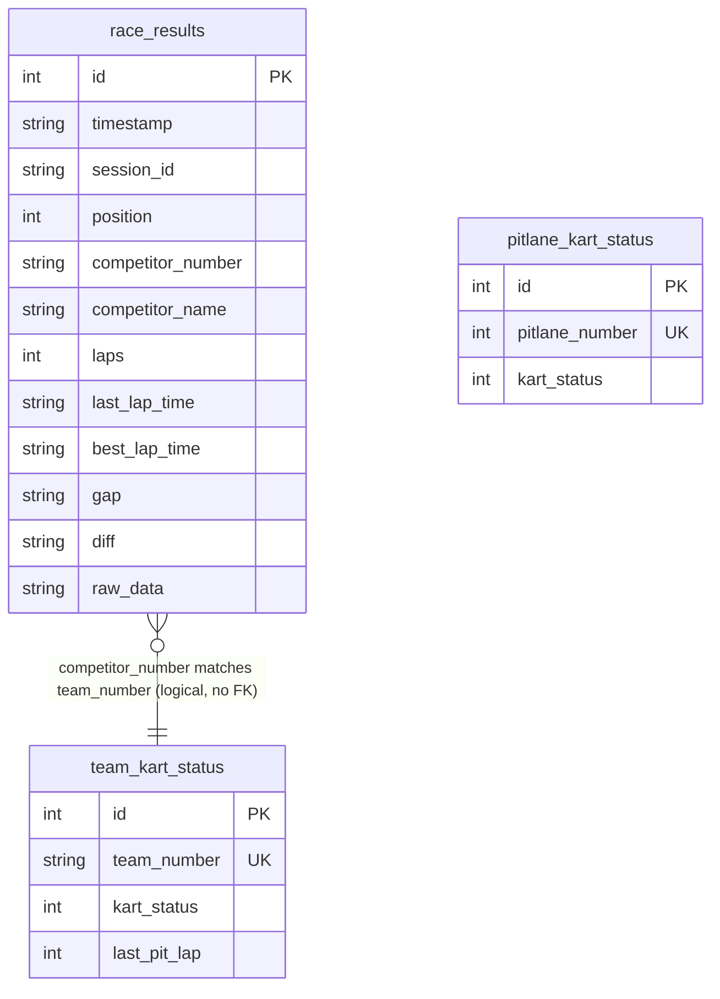

# ERD - Entity Relationship Diagram

## Database Schema: race_data.db (SQLite)



---

## Детальное описание таблиц

### 1. race_results

**Назначение**: Хранение результатов гонок, собранных скрапером

| Поле | Тип | Ограничения | Описание |
|------|-----|-------------|----------|
| `id` | INTEGER | PRIMARY KEY, AUTOINCREMENT | Уникальный идентификатор записи |
| `timestamp` | TEXT | NOT NULL, INDEX | ISO timestamp момента сбора данных |
| `session_id` | TEXT | NOT NULL, INDEX | Идентификатор сессии гонки |
| `position` | INTEGER | NULLABLE | Позиция участника в гонке |
| `competitor_number` | TEXT | NULLABLE | Номер участника |
| `competitor_name` | TEXT | NULLABLE | Имя участника |
| `laps` | INTEGER | NULLABLE | Количество пройденных кругов |
| `last_lap_time` | TEXT | NULLABLE | Время последнего круга (формат: "MM:SS.mmm") |
| `best_lap_time` | TEXT | NULLABLE | Лучшее время круга (формат: "MM:SS.mmm") |
| `gap` | TEXT | NULLABLE | Отставание от лидера |
| `diff` | TEXT | NULLABLE | Разница с предыдущим участником |
| `raw_data` | TEXT | NULLABLE | Дополнительные данные в формате JSON |

**Индексы**:
- `idx_timestamp` на поле `timestamp`
- `idx_session_id` на поле `session_id`

**Особенности**:
- Данные сохраняются при каждом изменении на странице SpeedHive
- Может содержать множество записей для одной сессии (по timestamp)
- `raw_data` хранится как JSON строка

---

### 2. team_kart_status

**Назначение**: Хранение статусов картов команд (управляется вручную через UI)

| Поле | Тип | Ограничения | Описание |
|------|-----|-------------|----------|
| `id` | INTEGER | PRIMARY KEY, AUTOINCREMENT | Уникальный идентификатор записи |
| `team_number` | TEXT | NOT NULL, UNIQUE, INDEX | Номер команды (уникальный) |
| `kart_status` | INTEGER | NOT NULL, CHECK(1-5) | Статус карта: 1=зеленый, 2=желтый, 3=оранжевый, 4=красный, 5=черный |
| `last_pit_lap` | INTEGER | NULLABLE | Номер последнего круга с пит-стопом |

**Индексы**:
- `idx_team_number` на поле `team_number`

**Ограничения**:
- `kart_status` должен быть в диапазоне 1-5
- `team_number` уникален (один статус на команду)

**Особенности**:
- Обновляется через API endpoint `PUT /api/teams/kart-status`
- Используется для визуализации статусов команд на фронтенде

---

### 3. pitlane_kart_status

**Назначение**: Хранение статусов картов пит-лейнов (управляется вручную через UI)

| Поле | Тип | Ограничения | Описание |
|------|-----|-------------|----------|
| `id` | INTEGER | PRIMARY KEY, AUTOINCREMENT | Уникальный идентификатор записи |
| `pitlane_number` | INTEGER | NOT NULL, UNIQUE, CHECK(1-4), INDEX | Номер пит-лейна (1-4, уникальный) |
| `kart_status` | INTEGER | NOT NULL, CHECK(1-5) | Статус карта: 1=зеленый, 2=желтый, 3=оранжевый, 4=красный, 5=черный |

**Индексы**:
- `idx_pitlane_number` на поле `pitlane_number`

**Ограничения**:
- `pitlane_number` должен быть в диапазоне 1-4
- `kart_status` должен быть в диапазоне 1-5
- `pitlane_number` уникален (один статус на пит-лейн)

**Особенности**:
- Обновляется через API endpoint `PUT /api/pitlanes/kart-status`
- Всегда должно быть 4 записи (по одной на каждый пит-лейн)
- Используется для визуализации статусов пит-лейнов на главной странице

---

## Связи между таблицами

**Важно**: В текущей схеме базы данных **нет внешних ключей (Foreign Keys)** между таблицами на уровне БД. Таблицы независимы друг от друга, но имеют логические связи на уровне приложения.

### Логические связи (Application-level)

#### 1. race_results ↔ team_kart_status

**Связь**: `race_results.competitor_number` → `team_kart_status.team_number`

**Тип**: Many-to-One (логическая связь, не FK)

**Использование в коде**:
- **Файл**: `frontend/src/pages/TeamKartStatusPage.tsx`
- **Логика**: 
  - При обнаружении команды в пит-лейне (`lastLapTime === "IN PIT"`) система использует `competitor_number` из `race_results` для поиска соответствующего статуса в `team_kart_status`
  - При сохранении пит-стопа номер круга (`laps`) сохраняется в `team_kart_status.last_pit_lap` для соответствующей команды
  - Происходит обмен статусами картов между командой и пит-лейном

**Пример использования** (строки 128-178 в TeamKartStatusPage.tsx):
```typescript
latestResults.forEach((result) => {
  if (!result.competitorNumber) return;
  
  const isInPit = result.lastLapTime && 
    String(result.lastLapTime).trim().toUpperCase() === 'IN PIT';
  
  if (isInPit) {
    // Используется competitor_number для поиска team_number
    const kartStatus = teamKartStatuses.get(result.competitorNumber) || 1;
    // Сохранение last_pit_lap на основе laps из race_results
    lastPitLap: result.laps
  }
});
```

**Особенности**:
- Связь не гарантирована на уровне БД (нет FK constraint)
- `competitor_number` может быть NULL в `race_results`
- `team_number` должен быть уникальным в `team_kart_status`
- Связь используется для:
  - Автоматического определения команд в пит-лейне
  - Отображения статусов картов команд на основе результатов гонки
  - Обмена статусами между командами и пит-лейнами

#### 2. pitlane_kart_status

**Связь**: Нет прямых связей с другими таблицами

**Использование**:
- Управляется вручную через UI (главная страница)
- Используется для обмена статусами с командами при пит-стопах
- Всегда содержит 4 записи (по одной на каждый пит-лейн 1-4)

### Независимые таблицы

- `race_results` - автономная таблица с данными гонок (заполняется скрапером)
- `team_kart_status` - автономная таблица со статусами команд (управляется через UI)
- `pitlane_kart_status` - автономная таблица со статусами пит-лейнов (управляется через UI)

---

## Статистика и размеры

**Ожидаемые объемы данных**:
- `race_results`: Высокий объем (тысячи записей на сессию, обновления каждую секунду)
- `team_kart_status`: Низкий объем (десятки записей - по одной на команду)
- `pitlane_kart_status`: Минимальный объем (4 записи - по одной на пит-лейн)

**Оптимизация**:
- Индексы на часто используемых полях для быстрого поиска
- Использование транзакций при массовых вставках (`saveMany`)
- Debounce при сохранении результатов (1 секунда) для снижения нагрузки

---

## SQL DDL (Data Definition Language)

```sql
-- race_results table
CREATE TABLE IF NOT EXISTS race_results (
    id INTEGER PRIMARY KEY AUTOINCREMENT,
    timestamp TEXT NOT NULL,
    session_id TEXT NOT NULL,
    position INTEGER,
    competitor_number TEXT,
    competitor_name TEXT,
    laps INTEGER,
    last_lap_time TEXT,
    best_lap_time TEXT,
    gap TEXT,
    diff TEXT,
    raw_data TEXT
);

CREATE INDEX IF NOT EXISTS idx_timestamp ON race_results(timestamp);
CREATE INDEX IF NOT EXISTS idx_session_id ON race_results(session_id);

-- team_kart_status table
CREATE TABLE IF NOT EXISTS team_kart_status (
    id INTEGER PRIMARY KEY AUTOINCREMENT,
    team_number TEXT NOT NULL UNIQUE,
    kart_status INTEGER NOT NULL CHECK(kart_status >= 1 AND kart_status <= 5),
    last_pit_lap INTEGER
);

CREATE INDEX IF NOT EXISTS idx_team_number ON team_kart_status(team_number);

-- pitlane_kart_status table
CREATE TABLE IF NOT EXISTS pitlane_kart_status (
    id INTEGER PRIMARY KEY AUTOINCREMENT,
    pitlane_number INTEGER NOT NULL UNIQUE CHECK(pitlane_number >= 1 AND pitlane_number <= 4),
    kart_status INTEGER NOT NULL CHECK(kart_status >= 1 AND kart_status <= 5)
);

CREATE INDEX IF NOT EXISTS idx_pitlane_number ON pitlane_kart_status(pitlane_number);
```
